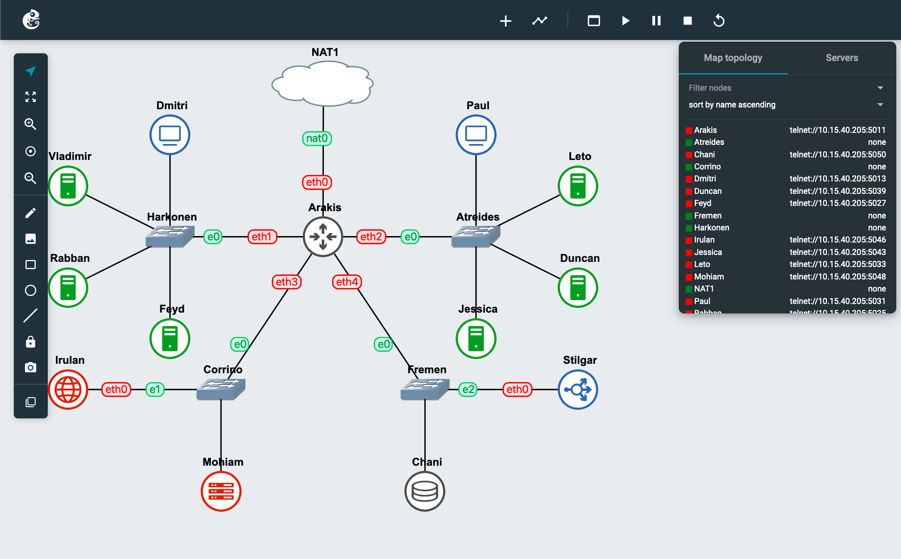

# Jarkom-Modul-3-IT09-2024

| Nama | NRP |
|---------|---------|
| Gavriel Pramuda Kurniaadi | 5027221031  |
| Stephanie Hebrina Mabunbun Simatupang | 5027221069  | 

## Topologi : 


| Node      | Kategori          | Image Docker                   | Konfigurasi IP |
|-----------|-------------------|--------------------------------|----------------|
| Arakis    | Router (DHCP Relay) | danielcristh0/debian-buster:1.1 | Dynamic        |
| Mohiam    | DHCP Server       | danielcristh0/debian-buster:1.1 | Static         |
| Irulan    | DNS Server        | danielcristh0/debian-buster:1.1 | Static         |
| Chani     | Database Server   | danielcristh0/debian-buster:1.1 | Static         |
| Stilgar   | Load Balancer     | danielcristh0/debian-buster:1.1 | Static         |
| Leto      | Laravel Worker    | danielcristh0/debian-buster:1.1 | Static         |
| Duncan    | Laravel Worker    | danielcristh0/debian-buster:1.1 | Static         |
| Jessica   | Laravel Worker    | danielcristh0/debian-buster:1.1 | Static         |
| Vladimir  | PHP Worker        | danielcristh0/debian-buster:1.1 | Static         |
| Rabban    | PHP Worker        | danielcristh0/debian-buster:1.1 | Static         |
| Feyd      | PHP Worker        | danielcristh0/debian-buster:1.1 | Static         |
| Dmitri    | Client            | danielcristh0/debian-buster:1.1 | Dynamic        |
| Paul      | Client            | danielcristh0/debian-buster:1.1 | Dynamic        |


### Arakis 
```
auto eth0
iface eth0 inet dhcp

auto eth1
iface eth1 inet static
	address 10.68.1.0
	netmask 255.255.255.0

auto eth2
iface eth2 inet static
	address 10.68.2.0
	netmask 255.255.255.0

auto eth3
iface eth3 inet static
	address 10.68.3.1
	netmask 255.255.255.0

auto eth4
iface eth4 inet static
	address 10.68.4.1
	netmask 255.255.255.0
```

### Feyd 
```
auto eth0
iface eth0 inet static
	address 10.68.1.3
	netmask 255.255.255.0
	gateway 10.68.1.0
```

### Rabban 
```
auto eth0
iface eth0 inet static
	address 10.68.1.2
	netmask 255.255.255.0
	gateway 10.68.1.0
```    

### Vladimir
```
auto eth0
iface eth0 inet static
	address 10.68.1.1
	netmask 255.255.255.0
	gateway 10.68.1.0
```

### Irulan
```
auto eth0
iface eth0 inet static
	address 10.68.3.2
	netmask 255.255.255.0
	gateway 10.68.3.1
```

### Mohiam
```
auto eth0
iface eth0 inet static
	address 10.68.3.3
	netmask 255.255.255.0
	gateway 10.68.3.1
```

### Chani
```
auto eth0
iface eth0 inet static
	address 10.68.4.2
	netmask 255.255.255.0
	gateway 10.68.4.1
```    

### Stilgar
```
auto eth0
iface eth0 inet static
	address 10.68.4.3
	netmask 255.255.255.0
	gateway 10.68.4.1
```

### Jessica
```
auto eth0
iface eth0 inet static
	address 10.68.2.3
	netmask 255.255.255.0
	gateway 10.68.2.0
```

### Duncan
```
auto eth0
iface eth0 inet static
	address 10.68.2.2
	netmask 255.255.255.0
	gateway 10.68.2.0
```

### Leto
```
auto eth0
iface eth0 inet static
	address 10.68.2.1
	netmask 255.255.255.0
	gateway 10.68.2.0
```

### Paul
```
auto eth0
iface eth0 inet dhcp
```

### Dmitri
```
auto eth0
iface eth0 inet dhcp
```

Menjalankan command ini di router Arakis :
```
iptables -t nat -A POSTROUTING -o eth0 -j MASQUERADE -s 10.68.0.0/16
echo 'nameserver 192.168.122.1' > /etc/resolv.conf
```

Menambahkan command dibawah ini pada seluruh node agar dapat terkoneksi internet :
```
echo 'nameserver 192.168.122.1' > /etc/resolv.conf
```

## Soal 1
Register name atreides.yyy.com untuk worker Laravel mengarah pada Leto Atreides & harkonen.yyy.com untuk worker PHP (0) mengarah pada Vladimir Harkonen

Jalankan script ini pada DNS server :

Mengupdate paket dan menginstal bind9 pada sistem
```
apt-get update 
apt-get install bind9 -y
```

```
echo '
zone "atreides.it09.com" {
        type master;
        file "/etc/bind/jarkom/atreides.it09.com";
};

zone "harkonen.it09.com" {
        type master;
        file "/etc/bind/jarkom/harkonen.it09.com";
};

' > /etc/bind/named.conf.local
```

Membuat direktori /etc/bind/jarkom, menyalin file db.local sebagai dasar, dan membuat file konfigurasi zona untuk domain atreides.it09.com dan harkonen.it09.com di dalamnya

```
mkdir /etc/bind/jarkom
cp /etc/bind/db.local /etc/bind/jarkom/atreides.it09.com

echo '
;
; BIND data file for local loopback interface
;
$TTL    604800
@       IN      SOA     atreides.it09.com. root.atreides.it09.com. (
                        2023101001      ; Serial
                         604800         ; Refresh
                          86400         ; Retry
                        2419200         ; Expire
                         604800 )       ; Negative Cache TTL
;
@       IN      NS      atreides.it09.com.
@       IN      A       10.68.2.1     ; IP Leto
www     IN      CNAME   atreides.it09.com.' > /etc/bind/jarkom/atreides.it09.com

cp /etc/bind/db.local /etc/bind/jarkom/harkonen.it09.com

echo '
; BIND data file for local loopback interface
;
$TTL    604800
@       IN      SOA     harkonen.it09.com. root.harkonen.it09.com. (
                        2023101001      ; Serial
                         604800         ; Refresh
                          86400         ; Retry
                        2419200         ; Expire
                         604800 )       ; Negative Cache TTL
;
@       IN      NS      harkonen.it09.com.
@       IN      A       10.68.1.3  ; IP Fyed
www     IN      CNAME   harkonen.it09.com.' > /etc/bind/jarkom/harkonen.it09.com
```

Restart bind9 :
```
service bind9 restart
```

# Soal 2-5
2. Semua CLIENT harus menggunakan konfigurasi dari DHCP Server. Client yang melalui House Harkonen mendapatkan range IP dari [prefix IP].1.14 - [prefix IP].1.28 dan [prefix IP].1.49 - [prefix IP].1.70
3. Client yang melalui House Atreides mendapatkan range IP dari [prefix IP].2.15 - [prefix IP].2.25 dan [prefix IP].2 .200 - [prefix IP].2.210 (3)
4. Client mendapatkan DNS dari Princess Irulan dan dapat terhubung dengan internet melalui DNS tersebut (4)
5. Durasi DHCP server meminjamkan alamat IP kepada Client yang melalui House Harkonen selama 5 menit sedangkan pada client yang melalui House Atreides selama 20 menit. Dengan waktu maksimal dialokasikan untuk peminjaman alamat IP selama 87 menit (5)
*house == switch

**Jalankan script ini pada DHCP server (Mohiam)**

Mengupdate paket, menginstal ISC DHCP Server, dan mengecek versi DHCP server yang telah diinstal.
```
echo 'nameserver 192.168.122.1' > /etc/resolv.conf

apt-get update
apt-get install isc-dhcp-server
dhcpd --version
```

Membuat konfigurasi subnet dan rentang alamat IP untuk klien di masing-masing subnet, yaitu pada Switch3 pada range '192.243.3.16' - '192.243.3.32', '192.243.3.64' - '192.243.3.80' dan Switc4 pada range '192.243.4.12' - '192.243.4.20' dan '192.243.4.160' -'192.243.4.168' sesuai dengan peritah soal. Kami juga menetapkan default-lease-time untuk Switch3 selama 3 menit sedangkan pada client yang melalui Switch4 selama 12 menit dan max-lease-time selama 96 menit, sesuai dengan perintah soal.

```
echo 'subnet 10.68.1.0 netmask 255.255.255.0 {
}

subnet 10.68.2.0 netmask 255.255.255.0 {
}

subnet 10.68.3.0 netmask 255.255.255.0 {
    range 10.68.1.14 10.68.1.28;
    range 10.68.1.49 10.68.1.70;
    option routers 10.68.3.1;
    option domain-name-servers '10.68.3.2';
    default-lease-time '300';
    max-lease-time '5220';
}

subnet 10.68.4.0 netmask 255.255.255.0 {
    range 10.68.2.15 10.68.2.25;
    range 10.68.2.200 10.68.2.210;
    option routers 10.68.4.1;
    option domain-name-servers '10.68.3.2';
    default-lease-time '1200';
    max-lease-time '5220';
}
' > /etc/dhcp/dhcpd.conf
```

Restart dan cek status bind9
```
service isc-dhcp-server restart
service isc-dhcp-server status
```
- DHCP Relay (Arakis)
Mengupdate paket, menginstal ISC DHCP Relay, dan memulai layanan DHCP relay
```
apt-get update
apt-get install isc-dhcp-relay -y
service isc-dhcp-relay start
```

Menetapkan konfigurasi DHCP relay dengan menentukan alamat IP DHCP server (Mohiam) pada SERVERS dan antarmuka yang digunakan oleh relay pada INTERFACES, sesuai dengan topologi yang dibuat.

```
echo '
SERVERS="10.68.3.3"
INTERFACES="eth1 eth2 eth3 eth4"
OPTIONS=' > /etc/default/isc-dhcp-relay
```

Mengaktifkan IP forwarding pada router. Hal ini memungkinkan router untuk meneruskan paket antara antarmuka yang berbeda.
```
echo 'net.ipv4.ip_forward=1' > /etc/sysctl.conf
```

Restart DHCP Relay
```
service isc-dhcp-relay restart
```


