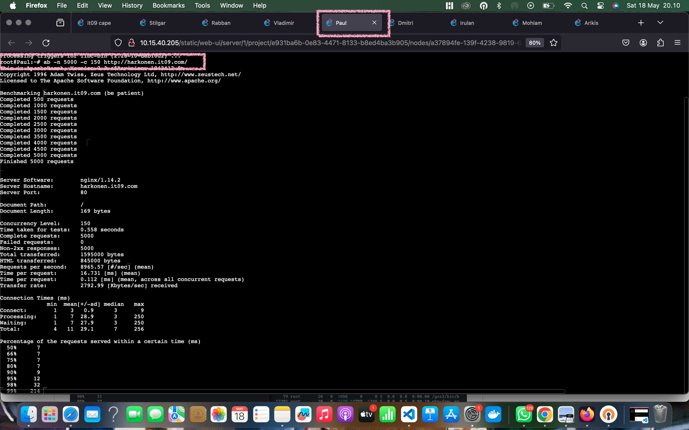
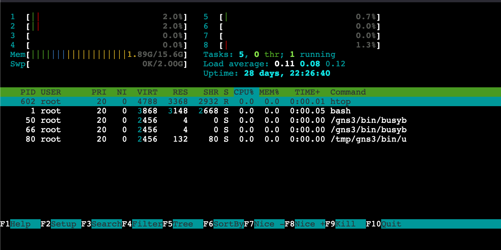
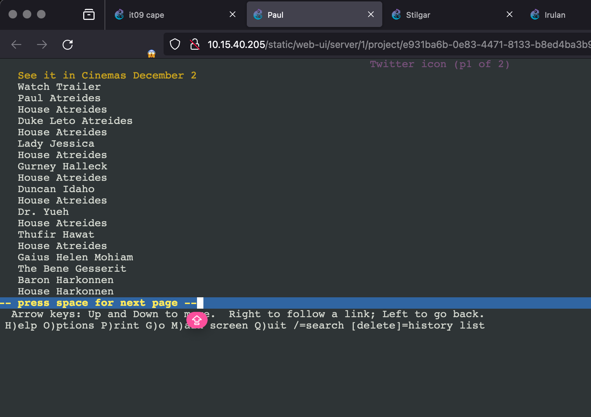

# Jarkom-Modul-3-IT09-2024

| Nama | NRP |
|---------|---------|
| Gavriel Pramuda Kurniaadi | 5027221031  |
| Stephanie Hebrina Mabunbun Simatupang | 5027221069  | 

## Topologi : 


| Node      | Kategori          | Image Docker                   | Konfigurasi IP |
|-----------|-------------------|--------------------------------|----------------|
| Arakis    | Router (DHCP Relay) | danielcristh0/debian-buster:1.1 | Dynamic        |
| Mohiam    | DHCP Server       | danielcristh0/debian-buster:1.1 | Static         |
| Irulan    | DNS Server        | danielcristh0/debian-buster:1.1 | Static         |
| Chani     | Database Server   | danielcristh0/debian-buster:1.1 | Static         |
| Stilgar   | Load Balancer     | danielcristh0/debian-buster:1.1 | Static         |
| Leto      | Laravel Worker    | danielcristh0/debian-buster:1.1 | Static         |
| Duncan    | Laravel Worker    | danielcristh0/debian-buster:1.1 | Static         |
| Jessica   | Laravel Worker    | danielcristh0/debian-buster:1.1 | Static         |
| Vladimir  | PHP Worker        | danielcristh0/debian-buster:1.1 | Static         |
| Rabban    | PHP Worker        | danielcristh0/debian-buster:1.1 | Static         |
| Feyd      | PHP Worker        | danielcristh0/debian-buster:1.1 | Static         |
| Dmitri    | Client            | danielcristh0/debian-buster:1.1 | Dynamic        |
| Paul      | Client            | danielcristh0/debian-buster:1.1 | Dynamic        |


### Arakis 
```
auto eth0
iface eth0 inet dhcp

auto eth1
iface eth1 inet static
	address 10.68.1.0
	netmask 255.255.255.0

auto eth2
iface eth2 inet static
	address 10.68.2.0
	netmask 255.255.255.0

auto eth3
iface eth3 inet static
	address 10.68.3.1
	netmask 255.255.255.0

auto eth4
iface eth4 inet static
	address 10.68.4.1
	netmask 255.255.255.0
```

### Feyd 
```
auto eth0
iface eth0 inet static
	address 10.68.1.5
	netmask 255.255.255.0
	gateway 10.68.1.1
```

### Rabban 
```
auto eth0
iface eth0 inet static
	address 10.68.1.4
	netmask 255.255.255.0
	gateway 10.68.1.1
```    

### Vladimir
```
auto eth0
iface eth0 inet static
	address 10.68.1.3
	netmask 255.255.255.0
	gateway 10.68.1.1
```

### Irulan
```
auto eth0
iface eth0 inet static
	address 10.68.3.2
	netmask 255.255.255.0
	gateway 10.68.3.1
```

### Mohiam
```
auto eth0
iface eth0 inet static
	address 10.68.3.3
	netmask 255.255.255.0
	gateway 10.68.3.1
```

### Chani
```
auto eth0
iface eth0 inet static
	address 10.68.4.3
	netmask 255.255.255.0
	gateway 10.68.4.1
```    

### Stilgar
```
auto eth0
iface eth0 inet static
	address 10.68.4.2
	netmask 255.255.255.0
	gateway 10.68.4.1
```

### Jessica
```
auto eth0
iface eth0 inet static
	address 10.68.2.5
	netmask 255.255.255.0
	gateway 10.68.2.1
```

### Duncan
```
auto eth0
iface eth0 inet static
	address 10.68.2.4
	netmask 255.255.255.0
	gateway 10.68.2.1
```

### Leto
```
auto eth0
iface eth0 inet static
	address 10.68.2.3
	netmask 255.255.255.0
	gateway 10.68.2.1
```

### Paul
```
auto eth0
iface eth0 inet dhcp
```

### Dmitri
```
auto eth0
iface eth0 inet dhcp
```

Menjalankan command ini di router Arakis :
```
iptables -t nat -A POSTROUTING -o eth0 -j MASQUERADE -s 10.68.0.0/16
echo 'nameserver 192.168.122.1' > /etc/resolv.conf
```

Menambahkan command dibawah ini pada seluruh node agar dapat terkoneksi internet :
```
echo 'nameserver 192.168.122.1' > /etc/resolv.conf
```

## Soal 1
Register name atreides.yyy.com untuk worker Laravel mengarah pada Leto Atreides & harkonen.yyy.com untuk worker PHP (0) mengarah pada Vladimir Harkonen

Jalankan script ini pada DNS server :

Mengupdate paket dan menginstal bind9 pada sistem
```
apt-get update 
apt-get install bind9 -y
```

```
echo -e "zone \"atreides.it09.com\" {
        type master;
        file \"/etc/bind/jarkom/atreides.it09.com\";
};

zone \"harkonen.it09.com\" {
        type master;
        file \"/etc/bind/jarkom/harkonen.it09.com\";
};" > /etc/bind/named.conf.local
```

Membuat direktori /etc/bind/jarkom dan membuat file konfigurasi zona untuk domain atreides.it09.com dan harkonen.it09.com di dalamnya

```
mkdir /etc/bind/jarkom

echo -e ";
; BIND data file for local loopback interface
;
\$TTL    604800
@       IN      SOA     harkonen.it09.com. root.harkonen.it09.com. (
                              2         ; Serial
                         604800         ; Refresh
                          86400         ; Retry
                        2419200         ; Expire
;
@       IN      NS      harkonen.it09.com.
@       IN      A       10.68.1.3" > /etc/bind/jarkom/harkonen.it09.com

echo -e ";
; BIND data file for local loopback interface
;
\$TTL    604800
@       IN      SOA     atreides.it09.com. root.atreides.it09.com. (
                              2         ; Serial
                         604800         ; Refresh
                          86400         ; Retry
                        2419200         ; Expire
                         604800 )       ; Negative Cache TTL
;
@       IN      NS      atreides.it09.com.
@       IN      A       10.68.2.3" > /etc/bind/jarkom/atreides.it09.com 
```
Restart bind9 :
```
service bind9 restart
```

# Soal 2-5
2. Semua CLIENT harus menggunakan konfigurasi dari DHCP Server. Client yang melalui House Harkonen mendapatkan range IP dari [prefix IP].1.14 - [prefix IP].1.28 dan [prefix IP].1.49 - [prefix IP].1.70
3. Client yang melalui House Atreides mendapatkan range IP dari [prefix IP].2.15 - [prefix IP].2.25 dan [prefix IP].2 .200 - [prefix IP].2.210 (3)
4. Client mendapatkan DNS dari Princess Irulan dan dapat terhubung dengan internet melalui DNS tersebut (4)
5. Durasi DHCP server meminjamkan alamat IP kepada Client yang melalui House Harkonen selama 5 menit sedangkan pada client yang melalui House Atreides selama 20 menit. Dengan waktu maksimal dialokasikan untuk peminjaman alamat IP selama 87 menit (5)
*house == switch

**Jalankan script ini pada DHCP server (Mohiam)**

Mengupdate paket, menginstal ISC DHCP Server, dan mengecek versi DHCP server yang telah diinstal.
```
echo 'nameserver 192.168.122.1' > /etc/resolv.conf

apt-get update
apt-get install isc-dhcp-server
dhcpd --version
```


```
echo 'nameserver 192.168.122.1' > /etc/resolv.conf

apt-get update 
apt-get install isc-dhcp-server

echo 'INTERFACESv4="eth0"' > /etc/default/isc-dhcp-server

echo 'subnet 10.68.3.0 netmask 255.255.255.0 {
}

# Harkonen
subnet 10.68.1.0 netmask 255.255.255.0 {
    range 10.68.1.14 10.68.1.28;
    range 10.68.1.49 10.68.1.70;
    option routers 10.68.1.1;
    option broadcast-address 10.68.1.255;
    option domain-name-servers 10.68.3.2;
    default-lease-time '300';
    max-lease-time '5220';
}

subnet 10.68.2.0 netmask 255.255.255.0 {
    range 10.68.2.15 10.68.2.25;
    range 10.68.2.200 10.68.2.210;
    option routers 10.68.2.1;
    option broadcast-address 10.68.2.255;
    option domain-name-servers 10.68.3.2;
    default-lease-time '1200';
    max-lease-time '5220';
}
' > /etc/dhcp/dhcpd.conf
```

Restart dan cek status bind9
```
service isc-dhcp-server restart
service isc-dhcp-server status
```

- DHCP Relay (Arakis)
Mengupdate paket, menginstal ISC DHCP Relay, dan memulai layanan DHCP relay
```
apt-get update
apt-get install isc-dhcp-relay -y
service isc-dhcp-relay start
```

Menetapkan konfigurasi DHCP relay dengan menentukan alamat IP DHCP server (Mohiam) pada SERVERS dan antarmuka yang digunakan oleh relay pada INTERFACES, sesuai dengan topologi yang dibuat.

```
echo -e 'SERVERS="10.68.3.3" #IP DHCP Mohiam
INTERFACES="eth1 eth2 eth3"
OPTIONS=' > /etc/default/isc-dhcp-relay
```

Mengaktifkan IP forwarding pada router. Hal ini memungkinkan router untuk meneruskan paket antara antarmuka yang berbeda.
```
echo 'net.ipv4.ip_forward=1' > /etc/sysctl.conf
```

Restart DHCP Relay
```
service isc-dhcp-relay restart
```

Output :
- ping atreidis.it09.com


- ping harkonen.it09.com


# Soal 6-12
6.  Vladimir Harkonen memerintahkan setiap worker(harkonen) PHP, untuk melakukan konfigurasi virtual host untuk website berikut dengan menggunakan php 7.3

Sebelum mengerjakan perlu untuk melakukan setup terlebih dahulu pada seluruh PHP Worker. 

Setup worker PHP (Rabban, Vladimir, Feyd) :
```
echo nameserver 10.68.3.2 > /etc/resolv.conf

apt-get update
apt-get install nginx -y
apt-get install lynx -y
apt-get install php php-fpm -y
apt-get install wget -y
apt-get install unzip -y
service nginx start
service php7.3-fpm start

service nginx start
service php7.3-fpm start
```

Jika sudah, silahkan untuk melakukan konfigurasi tambahan sebagai berikut untuk melakukan download dan unzip menggunakan command wget :

```
wget -O '/var/www/harkonen.it09.com' 'https://drive.google.com/file/d/1lmnXJUbyx1JDt2OA5z_1dEowxozfkn30&export=download'
unzip -o /var/www/harkonen.it09.com -d /var/www/
rm /var/www/harkonen.it09.com
mv /var/www/modul-3 /var/www/harkonen.it09.com
```

Kemudian cd, dan masukan ini ke shell :
```
cp /etc/nginx/sites-available/default /etc/nginx/sites-available/harkonen.it09.com
ln -s /etc/nginx/sites-available/harkonen.it09.com /etc/nginx/sites-enabled/
rm /etc/nginx/sites-enabled/default

echo 'server {
     listen 80;
     server_name _;

     root /var/www/harkonen.it09.com;
     index index.php index.html index.htm;

     location / {
         try_files $uri $uri/ /index.php?$query_string;
     }

     location ~ \.php$ {
         include snippets/fastcgi-php.conf;
         fastcgi_pass unix:/run/php/php7.3-fpm.sock;
         fastcgi_param SCRIPT_FILENAME $document_root$fastcgi_script_name;
         include fastcgi_params;
     }
 }' > /etc/nginx/sites-available/harkonen.it09.com

 service nginx restart
```
Output : 

- saat `wget` drive :


- `lynx localhost` Worker PHP :


7. Aturlah agar Stilgar dari fremen dapat dapat bekerja sama dengan maksimal, lalu lakukan testing dengan 5000 request dan 150 request/second. 

Melakukan setup terlebih dahulu di Stilgar (Load Balancer) terlebih dahulu:>

```
echo 'nameserver 10.68.3.2' > /etc/resolv.conf
apt-get update
apt-get install apache2-utils -y
apt-get install nginx -y
apt-get install lynx -y

service nginx start
```

Sebelum melakukan setup soal 7. Buka kembali Node DNS Server dan arahkan domain tersebut pada IP Load Balancer Stilgar

```
echo -e ";
; BIND data file for local loopback interface
;
\$TTL    604800
@       IN      SOA     harkonen.it09.com. root.harkonen.it09.com. (
                              2         ; Serial
                         604800         ; Refresh
                          86400         ; Retry
                        2419200         ; Expire
;
@       IN      NS      harkonen.it09.com.
@       IN      A       10.68.4.2" > /etc/bind/jarkom/harkonen.it09.com

echo -e ";
; BIND data file for local loopback interface
;
\$TTL    604800
@       IN      SOA     atreides.it09.com. root.atreides.it09.com. (
                              2         ; Serial
                         604800         ; Refresh
                          86400         ; Retry
                        2419200         ; Expire
                         604800 )       ; Negative Cache TTL
;
@       IN      NS      atreides.it09.com.
@       IN      A       10.68.4.2" > /etc/bind/jarkom/atreides.it09.com

service bind9 restart
```

Lalu kembali ke node Stilgar dan lakukan konfigurasi pada nginx sebagai berikut

```
cp /etc/nginx/sites-available/default /etc/nginx/sites-available/lb_php

echo ' upstream worker {
    server 10.68.1.3;   #Vladimir
    server 10.68.1.4;   #Rabban
    server 10.68.1.5;   #Feyd
}

server {
    listen 80;
    server_name harkonen.it09.com www.harkonen.it09.com;

    root /var/www/html;

    index index.html index.htm index.nginx-debian.html;

    server_name _;

    location / {
        proxy_pass http://worker;
    }
} ' > /etc/nginx/sites-available/lb_php

ln -s /etc/nginx/sites-available/lb_php /etc/nginx/sites-enabled/
rm /etc/nginx/sites-enabled/default

service nginx restart
```

Output :
- ab -n 5000 -c 150 http://harkonen.it09.com/





8. Karena diminta untuk menuliskan peta tercepat menuju spice, buatlah analisis hasil testing dengan 500 request dan 50 request/second masing-masing algoritma Load Balancer dengan ketentuan sebagai berikut:
a. Nama Algoritma Load Balancer
b. Report hasil testing pada Apache Benchmark
c. Grafik request per second untuk masing masing algoritma. 
d. Analisis

- Jalankan command berikut pada client 'Paul'
```
ab -n 500 -c 50 http://harkonen.it09.com/
```

Output :
- Round Robin


- Least-connection : `least_conn;`

```
root@Paul:~# ab -n 500 -c 50 http://harkonen.it09.com/
This is ApacheBench, Version 2.3 <$Revision: 1843412 $>
Copyright 1996 Adam Twiss, Zeus Technology Ltd, http://www.zeustech.net/
Licensed to The Apache Software Foundation, http://www.apache.org/

Benchmarking harkonen.it09.com (be patient)
Completed 100 requests
Completed 200 requests
Completed 300 requests
Completed 400 requests
Completed 500 requests
Finished 500 requests


Server Software:        nginx/1.14.2
Server Hostname:        harkonen.it09.com
Server Port:            80

Document Path:          /
Document Length:        169 bytes

Concurrency Level:      50
Time taken for tests:   0.057 seconds
Complete requests:      500
Failed requests:        0
Non-2xx responses:      500
Total transferred:      159500 bytes
HTML transferred:       84500 bytes
Requests per second:    8811.19 [#/sec] (mean)
Time per request:       5.675 [ms] (mean)
Time per request:       0.113 [ms] (mean, across all concurrent requests)
Transfer rate:          2744.89 [Kbytes/sec] received

Connection Times (ms)
              min  mean[+/-sd] median   max
Connect:        1    3   1.0      3       5
Processing:     1    3   1.1      3       6
Waiting:        1    3   1.1      3       6
Total:          3    5   1.3      5       9

Percentage of the requests served within a certain time (ms)
  50%      5
  66%      5
  75%      6
  80%      6
  90%      7
  95%      8
  98%      9
  99%      9
 100%      9 (longest request)
```


- IP Hash : `ip_hash;`




- Generic Hash : `hash $request_uri consistent;`


Hasil analisis : [disinii](IT09_Spice.pdf)

9. Dengan menggunakan algoritma Least-Connection, lakukan testing dengan menggunakan 3 worker, 2 worker, dan 1 worker sebanyak 1000 request dengan 10 request/second, kemudian tambahkan grafiknya pada peta.

Jalankan command berikut pada client :
```
ab -n 1000 -c 10 http://harkonen.it09.com/
```

- 1 Worker
```
Server Software:        nginx/1.14.2
Server Hostname:        harkonen.it09.com
Server Port:            80

Document Path:          /
Document Length:        169 bytes

Concurrency Level:      10
Time taken for tests:   0.128 seconds
Complete requests:      1000
Failed requests:        0
Non-2xx responses:      1000
Total transferred:      319000 bytes
HTML transferred:       169000 bytes
Requests per second:    7829.69 [#/sec] (mean)
Time per request:       1.277 [ms] (mean)
Time per request:       0.128 [ms] (mean, across all concurrent requests)
Transfer rate:          2439.13 [Kbytes/sec] received

Connection Times (ms)
              min  mean[+/-sd] median   max
Connect:        0    1   0.3      0       3
Processing:     0    1   0.4      1       4
Waiting:        0    1   0.4      1       3
Total:          1    1   0.7      1       6
ERROR: The median and mean for the initial connection time are more than twice the standard
       deviation apart. These results are NOT reliable.

Percentage of the requests served within a certain time (ms)
  50%      1
  66%      1
  75%      1
  80%      1
  90%      2
  95%      2
  98%      5
  99%      5
 100%      6 (longest request)
```


- 2 Worker
```
root@Paul:~# ab -n 1000 -c 10 http://harkonen.it09.com/
This is ApacheBench, Version 2.3 <$Revision: 1843412 $>
Copyright 1996 Adam Twiss, Zeus Technology Ltd, http://www.zeustech.net/
Licensed to The Apache Software Foundation, http://www.apache.org/

Benchmarking harkonen.it09.com (be patient)
Completed 100 requests
Completed 200 requests
Completed 300 requests
Completed 400 requests
Completed 500 requests
Completed 600 requests
Completed 700 requests
Completed 800 requests
Completed 900 requests
Completed 1000 requests
Finished 1000 requests


Server Software:        nginx/1.14.2
Server Hostname:        harkonen.it09.com
Server Port:            80

Document Path:          /
Document Length:        169 bytes

Concurrency Level:      10
Time taken for tests:   0.126 seconds
Complete requests:      1000
Failed requests:        0
Non-2xx responses:      1000
Total transferred:      319000 bytes
HTML transferred:       169000 bytes
Requests per second:    7942.75 [#/sec] (mean)
Time per request:       1.259 [ms] (mean)
Time per request:       0.126 [ms] (mean, across all concurrent requests)
Transfer rate:          2474.35 [Kbytes/sec] received

Connection Times (ms)
              min  mean[+/-sd] median   max
Connect:        0    1   0.3      0       2
Processing:     0    1   0.3      1       2
Waiting:        0    1   0.3      1       2
Total:          1    1   0.6      1       3
ERROR: The median and mean for the initial connection time are more than twice the standard
       deviation apart. These results are NOT reliable.

Percentage of the requests served within a certain time (ms)
  50%      1
  66%      2
  75%      2
  80%      2
  90%      2
  95%      2
  98%      3
  99%      3
 100%      3 (longest request)

```


- 3 Worker
```
root@Paul:~# ab -n 1000 -c 10 http://harkonen.it09.com/
This is ApacheBench, Version 2.3 <$Revision: 1843412 $>
Copyright 1996 Adam Twiss, Zeus Technology Ltd, http://www.zeustech.net/
Licensed to The Apache Software Foundation, http://www.apache.org/

Benchmarking harkonen.it09.com (be patient)
Completed 100 requests
Completed 200 requests
Completed 300 requests
Completed 400 requests
Completed 500 requests
Completed 600 requests
Completed 700 requests
Completed 800 requests
Completed 900 requests
Completed 1000 requests
Finished 1000 requests


Server Software:        nginx/1.14.2
Server Hostname:        harkonen.it09.com
Server Port:            80

Document Path:          /
Document Length:        169 bytes

Concurrency Level:      10
Time taken for tests:   0.129 seconds
Complete requests:      1000
Failed requests:        0
Non-2xx responses:      1000
Total transferred:      319000 bytes
HTML transferred:       169000 bytes
Requests per second:    7733.11 [#/sec] (mean)
Time per request:       1.293 [ms] (mean)
Time per request:       0.129 [ms] (mean, across all concurrent requests)
Transfer rate:          2409.05 [Kbytes/sec] received

Connection Times (ms)
              min  mean[+/-sd] median   max
Connect:        0    1   0.2      1       2
Processing:     0    1   0.2      1       2
Waiting:        0    1   0.2      1       2
Total:          1    1   0.4      1       3

Percentage of the requests served within a certain time (ms)
  50%      1
  66%      1
  75%      1
  80%      1
  90%      2
  95%      2
  98%      3
  99%      3
 100%      3 (longest request)
 ```


- Grafik :


10. Selanjutnya coba tambahkan keamanan dengan konfigurasi autentikasi di LB dengan dengan kombinasi username: “secmart” dan password: “kcksyyy”, dengan yyy merupakan kode kelompok. Terakhir simpan file “htpasswd” nya di /etc/nginx/supersecret/

Pada Load Balancer (Stilgar), tambahkan konfigurasi autentikasi di Load Balancer dan menyimpan file htpasswd :
```
# Buat direktori untuk menyimpan file htpasswd
mkdir -p /etc/nginx/supersecret

# Buat file htpasswd dengan kombinasi username dan password
htpasswd -c /etc/nginx/supersecret/htpasswd secmart
```

Lalu, masukkan passwordnya kcksit09, Jika sudah memasukkan password dan re-type password :


Tambahkan blok auth_basic dan auth_basic_user_file dalam blok location / 
```
echo ' upstream worker {
    server 10.68.1.3;   #Vladimir
    server 10.68.1.4;   #Rabban
    server 10.68.1.5;   #Feyd
}

server {
    listen 80;
    server_name harkonen.it09.com www.harkonen.it09.com;

    root /var/www/html;

    index index.html index.htm index.nginx-debian.html;

    server_name _;

        location / {

        proxy_pass http://worker;

        auth_basic "Restricted Content";
        auth_basic_user_file /etc/nginx/supersecret/htpasswd;
    }

ln -sf /etc/nginx/sites-available/lb_php /etc/nginx/sites-enabled/

if [ -f /etc/nginx/sites-enabled/default ]; then
    rm /etc/nginx/sites-enabled/default
fi

service nginx restart
```

11. Lalu buat untuk setiap request yang mengandung /dune akan di proxy passing menuju halaman https://www.dunemovie.com.au/

```
# Setup database
echo 'nameserver 10.68.3.2' > /etc/resolv.conf
apt-get update
apt-get install apache2-utils -y
apt-get install nginx -y
apt-get install lynx -y

service nginx start

cp /etc/nginx/sites-available/default /etc/nginx/sites-available/lb_php

echo ' upstream worker {
    server 10.68.1.3;   # Vladimir
    server 10.68.1.4;   # Rabban
    server 10.68.1.5;   # Feyd
}

server {
    listen 80;
    server_name harkonen.it09.com www.harkonen.it09.com;

    root /var/www/html;

    index index.html index.htm index.nginx-debian.html;

    server_name _;

    location / {
        proxy_pass http://worker;
    }

    location /dune {
        proxy_pass https://www.dunemovie.com.au/;
        proxy_set_header Host $host;
        proxy_set_header X-Real-IP $remote_addr;
        proxy_set_header X-Forwarded-For $proxy_add_x_forwarded_for;
        proxy_set_header X-Forwarded-Proto $scheme;
    }
} ' > /etc/nginx/sites-available/lb_php

ln -s /etc/nginx/sites-available/lb_php /etc/nginx/sites-enabled/
rm /etc/nginx/sites-enabled/default

service nginx restart

```

Output : 
- lynx http://harkonen.it09.com/dune




12. Selanjutnya LB ini hanya boleh diakses oleh client dengan IP [Prefix IP].1.37, [Prefix IP].1.67, [Prefix IP].2.203, dan [Prefix IP].2.207.

Tambahkan di Stilgar.sh :
```
location / {
    allow 10.68.1.37;
    allow 10.68.1.67;
    allow 10.68.2.230;
    allow 10.68.2.207;
    deny all;
    proxy_pass http://worker;
}
```

Tambahkan konfigurasi pada dhcp server (Mohiam) :
```
host Dmitri { #ini artinya pakai client Dmitri
    hardware ethernet 86:d3:f5:63:c5:2b;
    fixed-address 10.68.1.37;
}
```


`86:d3:f5:63:c5:2b` didapatkan dari node client (Dmitri) dengan menggunakan ip a lalu periksa yang terhubung dengan DHCP Relay (eth0)

`10.68.1.37` didapatkan dengan menentukan ip 10.68.1.37 sebagai ip client (Dmitri) lalu masukan 10.68.1.379 kedalam network configuration = /etc/network/interfaces

```
auto eth0
iface eth0 inet dhcp
hwaddress ether 86:d3:f5:63:c5:2b
```

- IP Dmitri setelah konfigurasi:


Output : 
Jalankan lynx http://harkonen.it09.com/ pada node Dmitri :


# Soal 13-20
Tidak mau kalah dalam perburuan spice, House atreides juga mengatur para pekerja di atreides.yyy.com.

13. Semua data yang diperlukan, diatur pada Chani dan harus dapat diakses oleh Leto, Duncan, dan Jessica. 

-  Setup Database Server (Chani)

```
echo 'nameserver 192.168.122.1' > /etc/resolv.conf

apt-get update
apt-get install mariadb-server -y
service mysql start

mysql <<EOF
CREATE USER 'it09'@'%' IDENTIFIED BY '123456';
CREATE USER 'it09'@'localhost' IDENTIFIED BY '123456';
CREATE DATABASE dbkelompokit09;
GRANT ALL PRIVILEGES ON *.* TO 'it09'@'%';
GRANT ALL PRIVILEGES ON *.* TO 'it09'@'localhost';
FLUSH PRIVILEGES;
quit
EOF

# Log in to MySQL with the specified user and password
mysql -u it09 -p'123456' <<EOF
SHOW DATABASES;
quit
EOF

echo '
[client-server]

[mysqld]
skip-networking=0
skip-bind-address' > /etc/mysql/my.cnf

service mysql restart
```

Penjelasan :
Pada kode di atas, dilakukan konfigurasi mysql dengan membuat user 'it09' dengan password '123456' serta membuat database 'dbkelompokit09'. Kemudian, dibuat akses ke database mysql dan menampilkan semua database dengan command 'SHOW DATABASES;'. Terakhir, dilakukan restart service mysql.

- Setup worker laravel

Menginstall dependencies yang diperlukan
```
apt-get update
apt-get install mariadb-server -y
```

- Testing

```
mariadb --host=10.68.4.2 --port=3306 --user=it09 --password
```


14. Leto, Duncan, dan Jessica memiliki **atreides** Channel sesuai dengan quest guide. Jangan lupa melakukan instalasi PHP8.0 dan Composer

Setup Laravel Worker (Leto, Duncan, Jessica)

a. Instalasi dependencies yang diperlukan

```
apt-get update
apt-get install lsb-release ca-certificates apt-transport-https software-properties-common gnupg2 -y
```

b. Unduh GPG-key dan tambahkan dengan perintah berikut

```
curl -sSLo /usr/share/keyrings/deb.sury.org-php.gpg https://packages.sury.org/php/apt.gpg
```

c. Instalasi php dan nginx

```
apt-get update
apt-get install php8.0-mbstring php8.0-xml php8.0-cli php8.0-common php8.0-intl php8.0-opcache php8.0-readline php8.0-mysql php8.0-fpm php8.0-curl unzip wget -y
apt-get install nginx -y
```

d. Jalankan service dari nginx dan php

```
service nginx start
service php8.0-fpm start
```

e. Instalasi Composer 2

```
wget https://getcomposer.org/download/2.0.13/composer.phar
chmod +x composer.phar
mv composer.phar /usr/bin/composer
```

f. Clone repository yang akan dideploy pada directory `/var/www` dan masuk ke directory repository tersebut

```
apt-get install git -y
cd /var/www/
git clone https://github.com/martuafernando/laravel-praktikum-jarkom
cd laravel-praktikum-jarkom
```

g. Jalankan composer dan buat file `.env` baru dengan command

```
composer update
cp .env.example .env
```

dan masukkan konfigurasi berikut ke dalam file `.env`

```
DB_CONNECTION=mysql
DB_HOST=10.68.4.2
DB_PORT=3306
DB_DATABASE=dbkelompokit09
DB_USERNAME=it09
DB_PASSWORD=123456
```

h. Jalankan konfigurasi dari php artisan

```
php artisan migrate:fresh
php artisan db:seed --class=AiringsTableSeeder
php artisan key:generate
php artisan jwt:secret
```

i. Tambahkan line berikut pada file `/etc/nginx/sites-available/deployment`

```
server {
	listen <port>;

	root /var/www/laravel-praktikum-jarkom/public;

	index index.php index.html index.htm;

	server_name _;

	location / {
		try_files $uri $uri/ /index.php?$query_string;
	}

	location ~ \.php$ {
		include snippets/fastcgi-php.conf;
		fastcgi_pass unix:/var/run/php/php8.0-fpm.sock;
	}

	location ~ /\.ht {
		deny all;
	}

	error_log /var/log/nginx/deployment_error.log;
	access_log /var/log/nginx/deployment_access.log;
}
```

`<port>` tersebut perlu disesuaikan lagi untuk setiap laravel worker dengan detail sebagai berikut:

-   Port `8001` untuk worker **Leto**
-   Port `8002` untuk worker **Duncan**
-   Port `8003` untuk worker **Jessica**

j. Atur symlink untuk enable pada site

```
ln -s /etc/nginx/sites-available/deployment /etc/nginx/sites-enabled/
```

k. Atur perizinan untuk mengelola dan mengakses direktori penyimpanan

```
chown -R www-data.www-data /var/www/laravel-praktikum-jarkom/storage
```

l. Jalankan service dari php-fpm dan restart service dari nginx

```
service php8.0-fpm start
service nginx restart
```

m. Testing

Testing dilakukan dengan menjalankan command berikut sesuai laravel worker

-   Worker **Leto**: `lynx localhost:8001`
-   Worker **Duncan**: `lynx localhost:8002`
-   Worker **Jessica**: `lynx localhost:8003`


15. **atreides** Channel memiliki beberapa endpoint yang harus ditesting sebanyak 100 request dengan 10 request/second. Tambahkan response dan hasil testing pada grimoire.

**POST /auth/register**

### Setup Client (Paul & Dmitri)

a. Tambahkan line berikut pada file `/auth.json`

```
{
    "username": "it09",
    "password": "123456"
}
```

### Testing

```
ab -n 100 -c 10 -p auth.json -T application/json http://atreides.it09.com:8001/api/auth/register
```


16. **atreides** Channel memiliki beberapa endpoint yang harus ditesting sebanyak 100 request dengan 10 request/second. Tambahkan response dan hasil testing pada grimoire.

**POST /auth/login**

### Testing

```
ab -n 100 -c 10 -p auth.json -T application/json http://atreides.it09.com:8001/api/auth/login
```


17. **atreides** Channel memiliki beberapa endpoint yang harus ditesting sebanyak 100 request dengan 10 request/second. Tambahkan response dan hasil testing pada grimoire.

**GET /me**

### Testing

```bash
curl -X POST -H "Content-Type: application/json" -d '{"username": "it09", "password": "123456"}' http://atreides.it09.com:8001/api/auth/login | jq -r '.token' > token.txt
```

Response dari request tersebut akan disimpan di token.txt.

Selanjutnya, masukkan token ke variabel global dengan jq
```bash
token=$(cat token.txt); curl -H "Authorization: Bearer $token" http://atreides.it09.com:8001/api/me
```
Kemudian jalankan command testing dibawah ini
```bash
ab -n 100 -c 10 -H "Authorization: Bearer $token" http://atreides.it09.com:8001/api/me
```


18. Untuk memastikan ketiganya bekerja sama secara adil untuk mengatur **atreides** Channel maka implementasikan Proxy Bind pada Eisen untuk mengaitkan IP dari Leto, Duncan, dan Jessica.

### Setup DNS Server (Irulan)

a. Mengedit konfigurasi DNS record pada `/etc/bind/it09/proxy-bind.it09.com` dengan mengarahkannya ke IP Stilgar

```
$TTL    604800
@       IN      SOA     atreides.it09.com. atreides.it09.com. (
                        2				; Serial
                        604800			; Refresh
                        86400			; Retry
                        2419200         ; Expire
                        604800 )		; Negative Cache TTL
;
@			IN      NS      atreides.it09.com.
@			IN      A       10.68.4.3 ; IP Stilgar
www			IN      CNAME   atreides.it09.com.
```

c. Restart service dari bind9

```
service bind9 restart
```

### Setup Load Balancer (Stilgar)

a. Edit konfigurasi file `/etc/nginx/sites-available/load-balancer-it09` menjadi seperti berikut

```
upstream worker {
	server 10.68.2.1; # IP Leto
	server 10.68.2.2; # IP Duncan
	server 10.68.2.3; # IP Jessica
}

server {
	listen 80;

	server_name atreides.it09.com www.atreides.it09.com;

	location / {
		proxy_pass http://worker;
    }
}
```

b. Restart service dari nginx

```
service nginx restart
```

### Testing

```
ab -n 100 -c 10 -p auth.json -T application/json http://atreides.it09.com/api/auth/login
```


19. Untuk meningkatkan performa dari Worker, coba implementasikan PHP-FPM pada Leto, Duncan, dan Jessica. Untuk testing kinerja naikkan

-   pm.max_children
-   pm.start_servers
-   pm.min_spare_servers
-   pm.max_spare_servers
    sebanyak tiga percobaan dan lakukan testing sebanyak 100 request dengan 10 request/second kemudian berikan hasil analisisnya pada PDF.

### Setup Load Balancer Stilgar

a. Edit konfigurasi file `/etc/nginx/sites-available/load-balancer-it09` menjadi seperti berikut

```
upstream worker {
	server 10.68.2.2; # IP Leto
	server 10.68.2.3; # IP Duncan
	server 10.68.2.4; # IP Jessica
}

server {
	listen 80;

	server_name atreides.it09.com www.atreides.it09.com;

	location / {
		proxy_pass http://worker;
    }
}
```

b. Restart service dari nginx

```
service nginx restart
```

### Setup Laravel Worker (Leto, Duncan, Jessica)

a. Tambahkan line berikut pada file `/etc/php/8.0/fpm/pool.d/loadbalancer.conf`

```
[loadbalancer]
user = loadbalancer_user
group = loadbalancer_user
listen = /var/run/php8.0-fpm-loadbalancer-site.sock
listen.owner = loadbalancer_user
listen.group = loadbalancer_user
php_admin_value[disable_functions] = exec,passthru,shell_exec,system
php_admin_flag[allow_url_fopen] = off

; Choose how the process manager will control the number of child processes.

pm = dynamic
pm.max_children = <value>
pm.start_servers = <value>
pm.min_spare_servers = <value>
pm.max_spare_servers = <value>
pm.process_idle_timeout = 10s
```
Nilai dari `<value>` tersebut diatur pada saat melakukan percobaan berikut

#### Percobaan Pertama

```
pm.max_children = 10
pm.start_servers = 2
pm.min_spare_servers = 1
pm.max_spare_servers = 5
```


#### Percobaan Kedua

```
pm.max_children = 30
pm.start_servers = 5
pm.min_spare_servers = 3
pm.max_spare_servers = 10
```


#### Percobaan Ketiga

```
pm.max_children = 50
pm.start_servers = 10
pm.min_spare_servers = 5
pm.max_spare_servers = 20
```


20. Nampaknya hanya menggunakan PHP-FPM tidak cukup untuk meningkatkan performa dari worker maka implementasikan Least-Conn pada Stilgar. Untuk testing kinerja dari worker tersebut dilakukan sebanyak 100 request dengan 10 request/second.

### Setup Load Balancer (Stilgar)

a. Edit bagian `upstream worker` pada file `/etc/nginx/sites-available/load-balancer-it09` menjadi seperti berikut

```
upstream worker {
	least_conn;
	server 10.68.2.1; # IP Leto
	server 10.68.2.2; # IP Duncan
	server 10.68.2.3; # IP Jessica
}
```

b. Restart service dari nginx

```
service nginx restart
```

### Testing

```
ab -n 100 -c 10 -p auth.json -T application/json http://atreides.it09.com/api/auth/login
```


